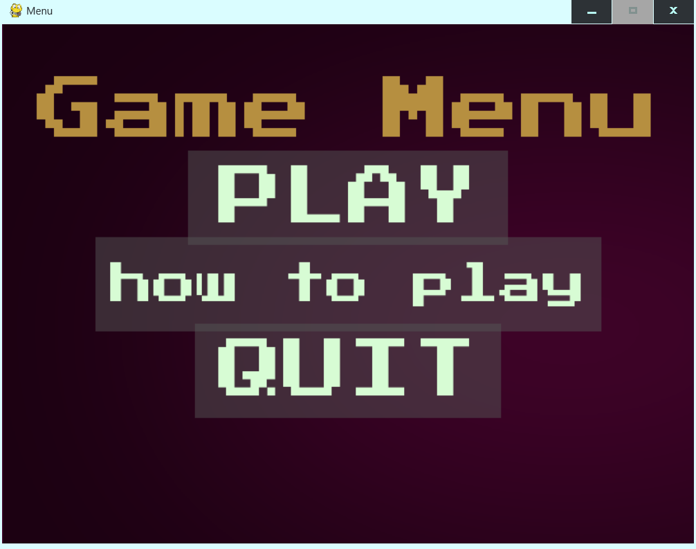
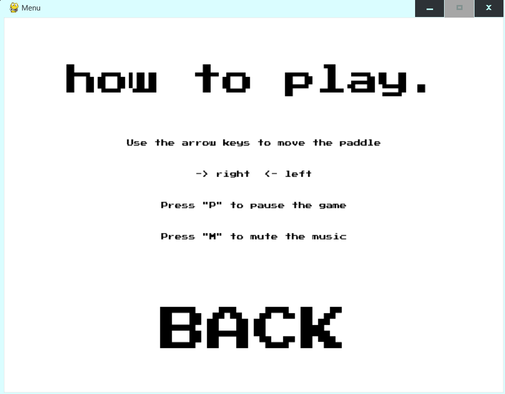
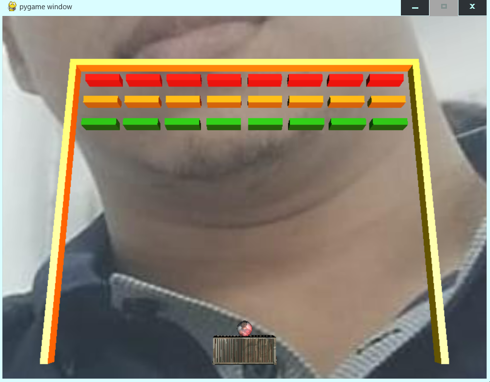
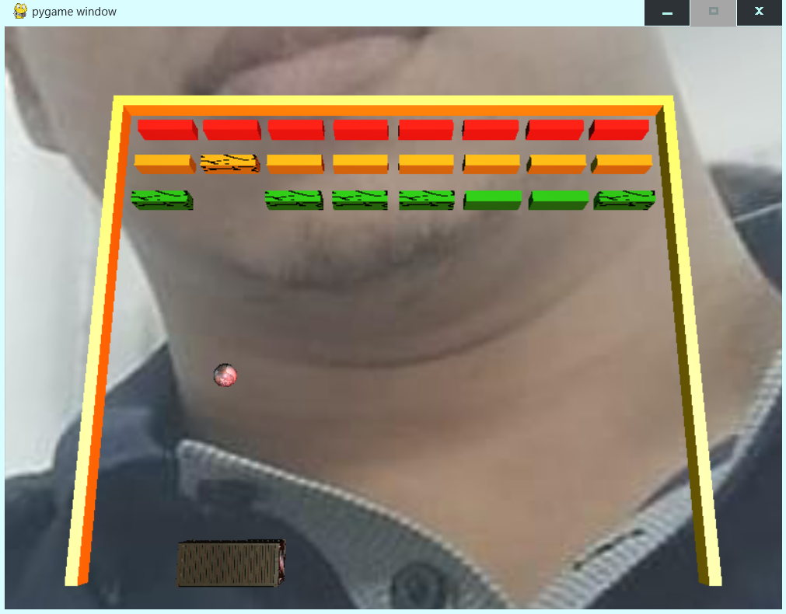

# Bricks3D
3D brick breaker game made using Python as a language using the OpenGL pipeline forthe graphics.


## Acknowledgements

 We made this project to prove our skills in 3D graphics and rendering with a low-level graphics API like OpenGL that we got from university classes, self study and tutorials. This is the final project for the Graphics Programming class. It is not a really complex game in terms of code and logics, since we wanted to overcomplicate us, but of course it complies with the requirements that were established by the teacher and yet, a bit more because we had to deal with the logic of collisions and the movement of the ball. It was challenging but fun to make this project.


## Structure
This project is structured so that the assets, textures, models, audios and objects are separated by modules from the functionality of the program itself.
This is how the project looks like as of las commit:
```txt
BRICKS3D/
├── assets
│   ├── Background.png
│   ├── font.tff
│   ├── Options Rect.png
│   ├── Play Rect.png
│   ├── Quit Rect.png
│ 
├── models\container
│   ├── 10519_Pingpong_paddle_v1_L3.mtl
│   ├── 10519_Pingpong_paddle_v1_L3.obj
│   ├── Container.mtl
│   ├── Container.obj
│
├── Objects
│   ├── Base3DObjects.py
│   ├── Environment.py
│   ├── Game3DObjects.py
│   └── GameBricks.py
│ 
├── sounds
│   ├── bones.mp3
│   ├── melody.mp3
│   ├── pop.mp3
│   └── PopPop.mp3
│
├── Textures
│  ├── 10519_Pingpong_paddle_v1_Diffuse.jpg
│  ├── BallSaul2.jpeg
│  ├── Container.jpg
│  ├── crack1.png
│  ├── crack2.png
│  ├── crack3.png
│  ├── hola.png
│  ├── skydome.jpeg
│  └── skyDomSaul.jpeg
├── .gitignore
├── .BezierMotion.py
├── button.py
├── Control3DProgram.py
├── Matrices.py
├── menu.py
├── ojb_3D_loading.py
├── requirements.textures
├── Shaders.py
├── simple3D.frag
├── simple3D.vert
└── texture_loading.py
```
## Building

---
The project requires:
- Python >= 3.6
- Pip:
  - pygame
  - pyopengl
  - numpy
To download the project, run:
 ```sh
 git clone https://github.com/Conter18/Bricks3D.git
 pip install -r requirements.txt
 ```
 Then run menu.py to play




